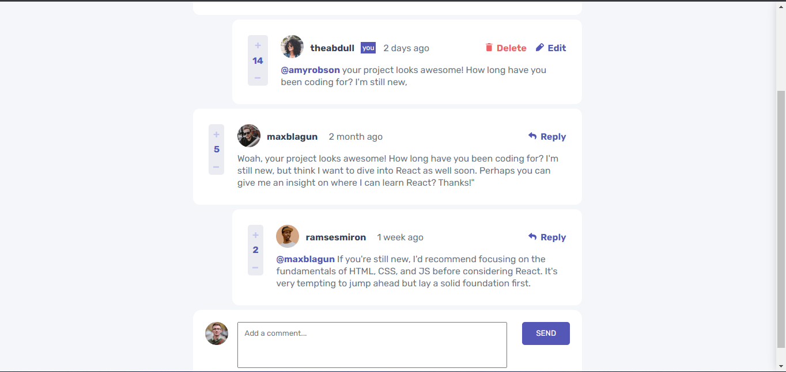

# Comment-Section Documentation

## Table Of Content

1. Introduction
2. Getting Started
    - Prerequisites
    - Installation
3. Usage
    - Feature 
    - Screenshots 
## 1. Introduction
The comment section app is an interactive app, where users can post, delete, reply, edit, rate comment and posts seamlessly

## 2. Getting Started
### Prerequisites
To use the comment Comment section App, you need the following:
- A web browser (e.g., Google Chrome, Mozilla Firefox)
- Text editor or Integrated Development Environment (IDE)

### Installation
1. Download the source code from the GitHub repository.
2. Extract the downloaded file to a desired location on your computer.

## 3. Usage
### Feature
- User are able no able to post, delete and edit COMMENTS
- users are able to post, delete, and edit REPLYS
- Rate comments and reply

### Screenshot

